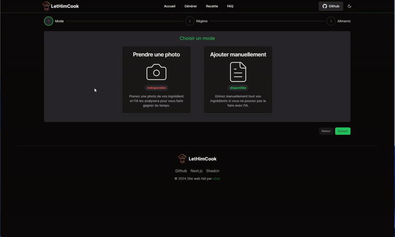

# Cooking-AI

This is a Next.js web application that generates cooking recipes using a locally running AI model (Ollama). The project uses Shadcn as the UI framework and Tailwind CSS for styling. It is built with TypeScript and containerized using Docker.

## Features

- **Next.js**: A React framework for building modern web applications.
- **Shadcn**: A UI framework for building responsive and accessible user interfaces.
- **Tailwind CSS**: A utility-first CSS framework for styling.
- **TypeScript**: Strongly-typed JavaScript to improve code quality and maintainability.
- **Ollama AI**: Local AI model, used for generating cooking recipes.
- **Docker**: Containerized application for easy setup and deployment.

## Getting Started

Follow these instructions to get a copy of the project up and running on your local machine.

### Prerequisites

Make sure you have the following installed:

- [Docker](https://www.docker.com/get-started)
- [Docker Compose](https://docs.docker.com/compose/install/)

### Installation

1. **Clone the repository:**

    ```bash
    git clone https://github.com/x0ze/Cooking-AI.git
    cd Cooking-AI
    ```
2. **Start the containers:**

    Use Docker Compose to start the containers:

    ```bash
    docker-compose up
    ```

    This will create and start two containers:
    - **Next.js Application**: Running on port `3000`.
    - **Ollama AI**: Running on the 8080 but you dont need to acess.

3. **Install LLM:**

    Choose your favorite LLM in Ollama and pull it int the cook_ollama_next docker

   ```bash
    docker exec -it cook_ollama_next bash
    ollama pull llama3
    ```

   This will start the llama3 llm from Meta
       

5. **Access the application:**

    Once the containers are up and running, you can access the web application in your browser at:

    ```plaintext
    http://localhost:3000
    ```
    

## Usage

- Navigate through the UI to generate recipes.
  
- Interact with the form to input ingredients or other preferences.
  
- View the generated recipe with instructions (the recipe given in the example was generated with llama3 in 2024).
  
